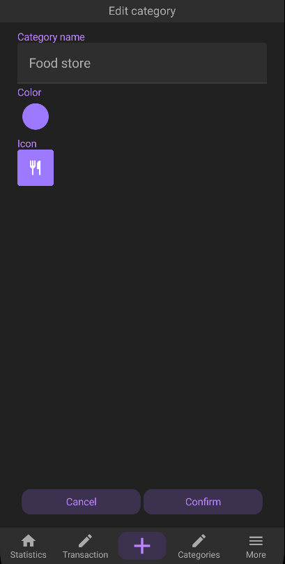

# Finance budget app
An Android application to track your finances that 

### Tech
This project is made using Kotlin and Jetpack Compose for the UI. Gradle is used as the build system.

### Functionality

#### 1. Category creation / editing

A user has the ability to create, edit, delete categories. \
Each category has a name, user defined color and icon

