# Finance budget app
An Android application to track your finances 

This application is made using Kotlin and Jetpack Compose for the UI. Gradle is used as the build system.

## Functionality

#### 1. Category creation / editing

A user has the ability to create, edit, delete categories. \
Each category has a name, user defined color and icon.

  
  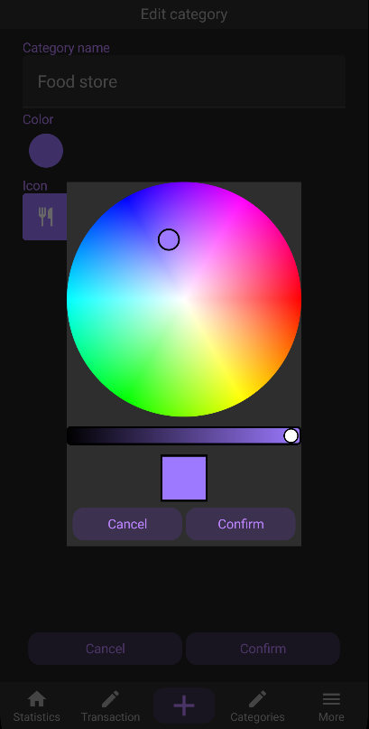
  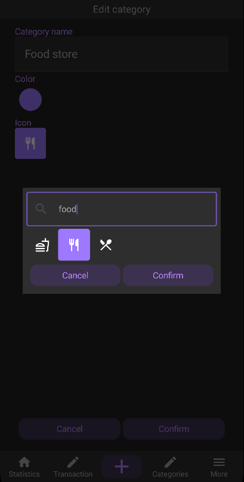

#### 2. Transaction creation / editing

A user can register an expense or income transaction using the + button at the bottom of the screen.

The user will be promted to enter a value, assign a category, write a note (optional) and change the time of the transaction that is set to the system time of the device by default.

  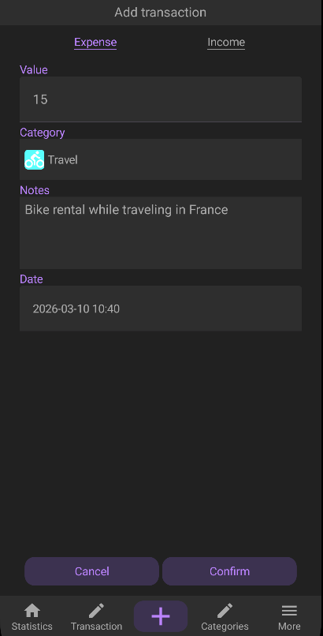
  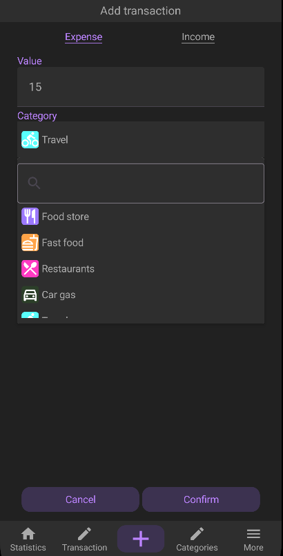
  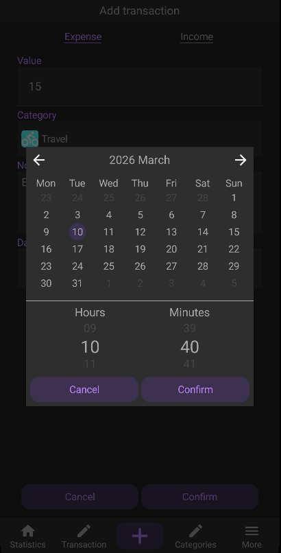
  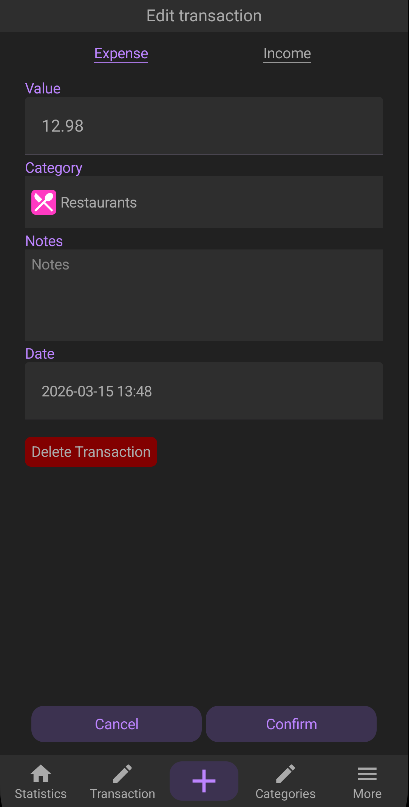

#### 3. View categories

The user also has the ability to view all the available categories and enter the categories to edit them or delete from the menu. \
(Note: if there is at least 1 transaction assigned to a category deleting it will result in the transaction being assigned to UNKNOWN category).

  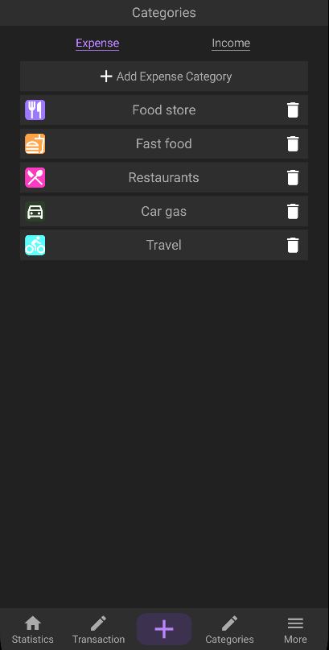
  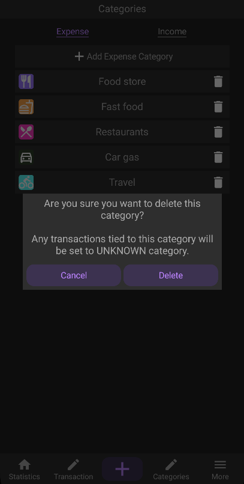

#### 4. View transactions

The user can view all available transactions that meet filter requirments (filter by what types of categories to show, time range or text content). \
They can also enter transaction edit mode from this screen.

  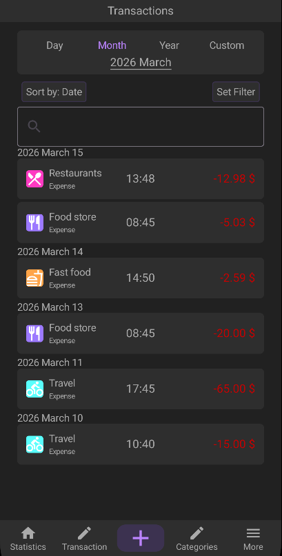
  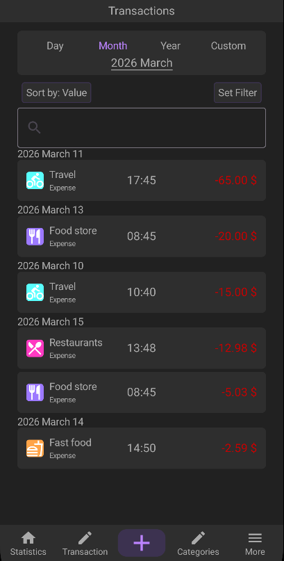
  

  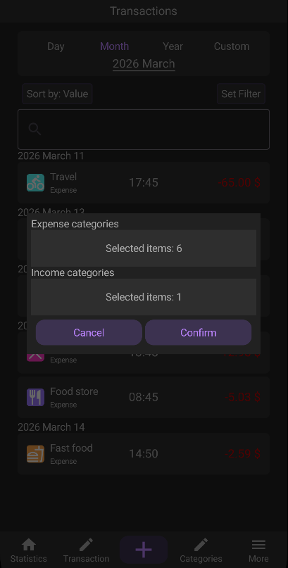
  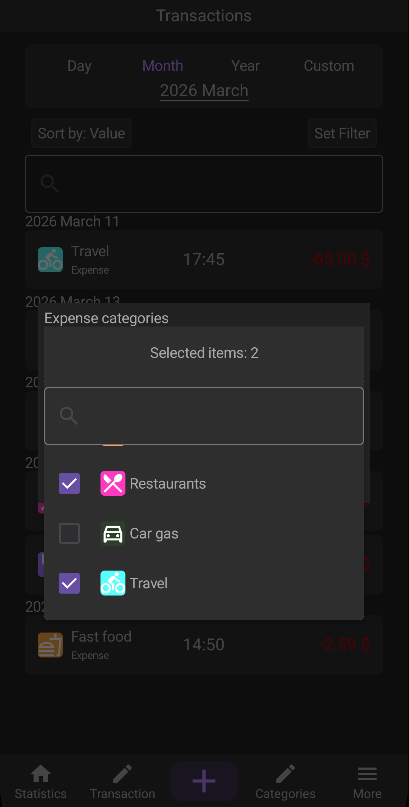
  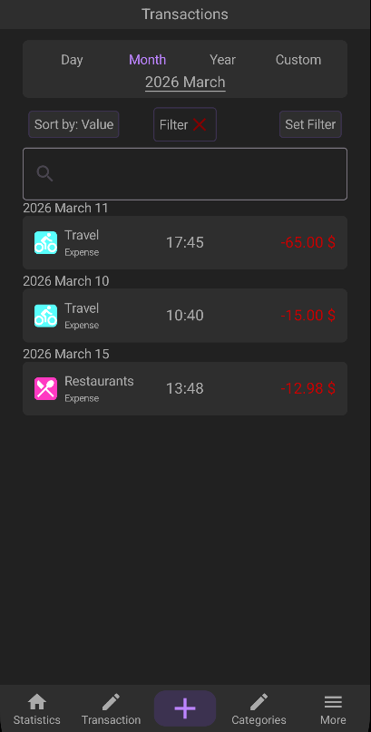

#### 5. Statistics

Finally the user can view the statistics for each category during a selected time range and other filters.

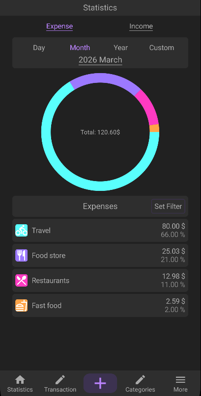

